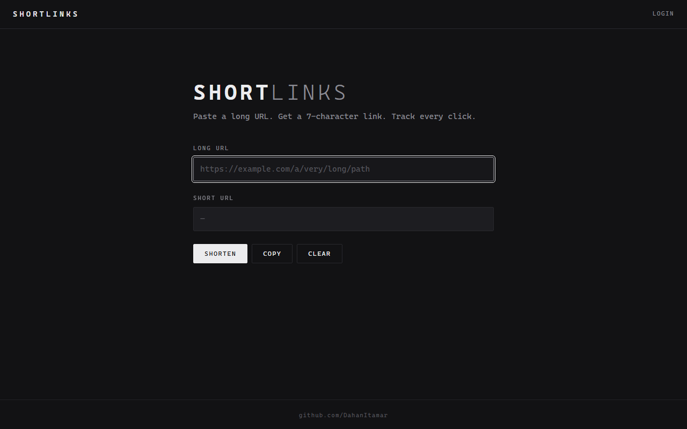
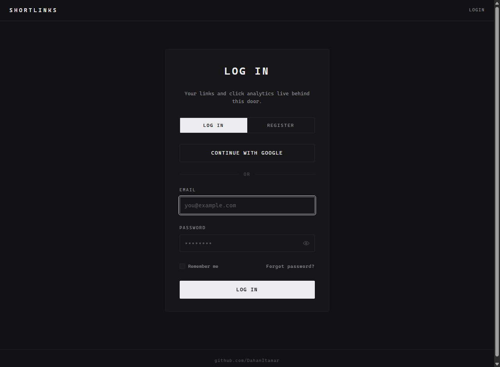

<div align="center">

# ShortLinks

**A URL shortener with per-user click analytics — paste a long URL, get a 7-character link, and see every click with its timestamp and visitor IP.**

ASP.NET Core 8 MVC · EF Core · ASP.NET Identity (with optional Google sign-in) · vanilla-JS frontend.



</div>

---

## What It Does

- **Cut** — `POST /Api/cutter` validates the URL, generates a cryptographically random 7-character code and returns the short link. The same URL from the same user always maps to the same code.
- **Redirect** — `GET /W/{code}` records the click (UTC timestamp + visitor IP) and 302-redirects to the original URL.
- **Track** — signed-in users get a **My Links** page with a click-count bar per link, and a per-link **click log**.

Anonymous visitors can cut and follow links; accounts (email or Google) are only needed for analytics.

<div align="center">



</div>

### Real Example

```
$ curl -X POST http://localhost:5088/Api/cutter \
       -H "Content-Type: application/json" \
       -d '"https://github.com/DahanItamar/ShortLinks-Project"'
http://localhost:5088/W/jBpJht3

$ curl -i http://localhost:5088/W/jBpJht3
HTTP/1.1 302 Found
Location: https://github.com/DahanItamar/ShortLinks-Project
```

## Security

- **Ownership enforced at the query** — `/W/Links` and `/W/Entries` require authentication, and every lookup filters by the session's user ID. There is no way to pass someone else's ID and read their links or click logs.
- **Unguessable codes** — short codes come from `RandomNumberGenerator`, not a seeded `Random`. 62⁷ ≈ 3.5 × 10¹² combinations.
- **Secrets never in git** — Google OAuth credentials load from user-secrets or environment variables ([`.env.example`](.env.example) shows the exact keys). Without them the app still runs; the Google button renders but can't complete the round-trip.

## The API

| Method | Route | Auth | |
|:-:|---|:-:|---|
| `POST` | `/Api/cutter` | — | Body `"https://long.url"` → short link |
| `GET` | `/W/{code}` | — | Log the click, redirect to the original URL |
| `GET` | `/W/Links` | ✓ | The signed-in user's links with click counts |
| `GET` | `/W/Entries?shortURL={code}` | ✓ | Click log for one of the user's own links |

## Running It

The only requirement: [.NET SDK 8](https://dotnet.microsoft.com/download/dotnet/8.0).

```bash
dotnet run          # http://localhost:5088
```

Works out of the box on an in-memory database — zero setup. Have SQL Server? Fill in `ConnectionStrings:UrlsDataBase` in `appsettings.json`. Want working Google sign-in? Copy the two keys from [`.env.example`](.env.example) into user-secrets with your own Google OAuth credentials.

## Under the Hood — Briefly

- **ASP.NET Core 8 MVC** — Razor views for the pages, a small API controller for the JSON endpoints, ASP.NET Identity for accounts (default UI, plus Google as an external provider when configured).
- **Data** — EF Core over `IdentityDbContext`: one `Link` table (code, original URL, owner) with click `Entry` rows per link. SQL Server with automatic schema creation, or in-memory when no connection string is set.
- **Frontend** — monochrome, monospace, hand-written CSS/JS. No SPA framework.

> Built as a learning exercise in 2023; updated in 2026: .NET 8, in-memory zero-setup mode, ownership-guarded analytics, crypto-random codes and the monochrome UI.

---

<div align="center">

Built by <a href="https://github.com/DahanItamar">Itamar Dahan</a> · © 2026

</div>
